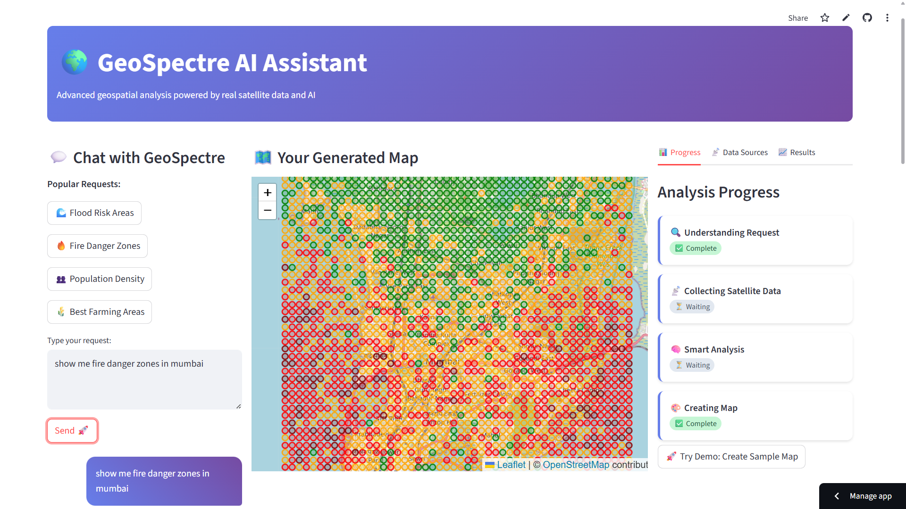
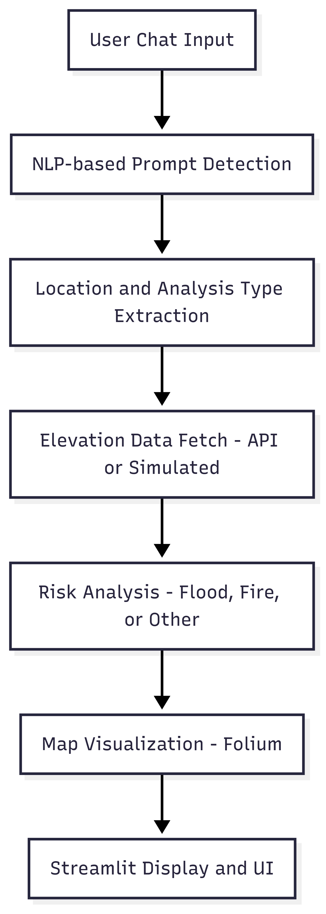

# GeoSpectre AI Assistant



**GeoSpectre** is an AI-powered geospatial assistant that provides interactive maps and actionable insights for:
- Flood Risk
- Fire Danger
- Elevation Analysis
- Farming Suitability
- Population Density

It uses **real satellite and terrain data** from OpenTopography and other sources.

---

## 🚀 Features

- 🌐 Real-Time Satellite Integration via OpenTopography API
- 🌊 Flood Risk Mapping using elevation and rainfall factors
- 🔥 Fire Danger Analysis based on terrain and temperature
- 🗻 Elevation Visualizations with heatmaps and contours
- 🌾 Farming Suitability Checks for specific regions
- 🏙️ Population Density & Urban Planning Insights
- 💬 Conversational AI Interface with natural language queries
- 🗺️ Interactive Maps rendered with Folium and Streamlit

---

## 🖼️ App UI Preview



---

## 🛠️ Tech Stack

- **Frontend**: Streamlit
- **Geospatial Visualization**: Folium, Plotly
- **Data Sources**: OpenTopography API, Weather APIs, Census, Land Use Data
- **Language**: Python

---

## 🔍 Core Functionalities

### 💬 Chat-Driven Analysis
Example prompts:
- "Show me flood risk areas in Kerala with rainfall data"
- "Create a fire danger map for California forests"
- "Find best farming areas in Punjab"

### 🌐 Data Fetching
- Fetch DEM (Digital Elevation Model) via OpenTopography API
- Generate synthetic elevation if real DEM is unavailable

### ⚠️ Risk Analysis
- **Flood Risk**: Based on elevation & rainfall factor
- **Fire Danger**: Based on elevation & temperature factor

### 🗺️ Map Rendering
- Folium-based heatmaps and circle markers
- Risk-level color codes with interactive popups and legends

---

## 🌎 Supported Cities

Supports 40+ cities (Indian and global):
- Mumbai, Delhi, Kerala, Bengaluru, Chennai, Hyderabad, Pune, Kolkata, Jaipur, Lucknow...
- (Full list implemented using keyword-to-coordinates matching)

---

## Export & Share

- Download generated map
- Placeholder: Shareable link & map editing
- Planned: Export to GeoTIFF / SHP

---

## Architecture

```mermaid
flowchart TD
    A[User Chat Input] --> B[NLP-based Prompt Detection]
    B --> C[Location + Analysis Type Extraction]
    C --> D[Elevation Data Fetch (API or Simulated)]
    D --> E[Risk Analysis (Flood/Fire/etc)]
    E --> F[Map Visualization (Folium)]
    F --> G[Streamlit Display + UI]
```

---

## About the AI

The `GeoSpectreAI` class handles:
- Elevation Data Fetching
- Risk Analysis Models
- Interactive Map Generation

---

## Future Work

- QGIS / GDAL Integration
- Better Prompt Understanding using LLMs
- Rainfall + Terrain Overlay Enhancements
- Export to GeoTIFF / SHP formats
- LangChain-based geospatial task chains
